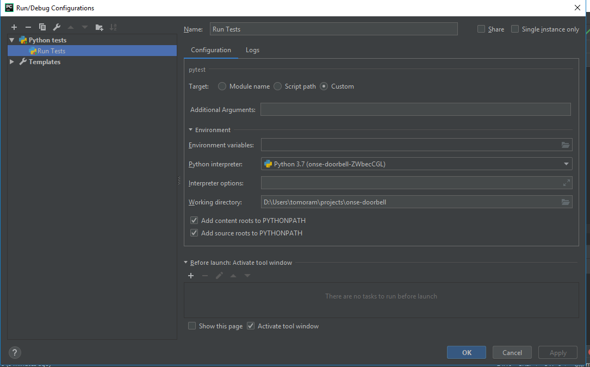

# BDD Lab (Social Network)

This is the source material for the BDD lab.

The goal of this lab is to show how to use human readable specifications
to drive the development of a system - by using
[behave](https://github.com/behave/behave), the cucumber-clone BDD
framework for Python, to make the specifications into automated tests.

## Setup

Make sure you have the latest version of Python installed (currently
3.7.1) from the [Python
website](https://www.python.org/downloads/release/python-371/).

From within the repository folder, please install the following in order
to run the project:

``` bash
# install the dependencies from Pipfile:
poetry install

# activate this project's virtualenv:
poetry shell
```

Poetry "Poetry is a tool for dependency management and packaging in
Python. It allows you to declare the libraries your project depends on
and it will manage (install/update) them for you."
[1](https://python-poetry.org/docs/)

## Running tests

The following commands can be executed inside your `poetry shell`.

You can also execute them from outside your poetry shell by prefixing
`poetry run` in front of them. For example for `flake8`,
`poetry run flake8` however, it will save you some typing to be inside
the shell

### Style & Linting

``` bash
flake8
```

### Unit Tests

``` bash
python -m pytest
```

### Acceptance Tests (features)

``` bash
behave
```

## PyCharm Run Configuration

Add a run configuration of type `Python tests -> pytest` with the
following settings:



**REMARK**:

The BDD support is available only in the PyCharm Professional Edition,
not in the Community Edition.
